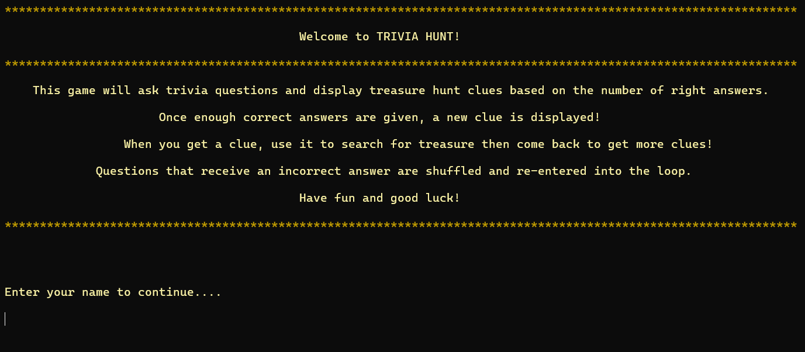
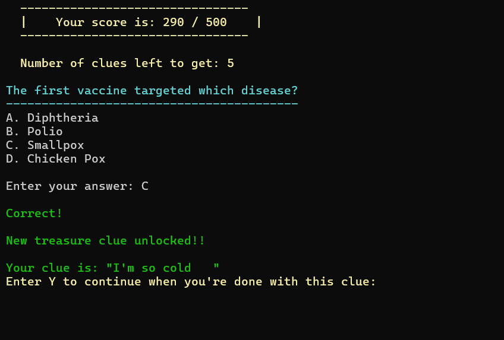
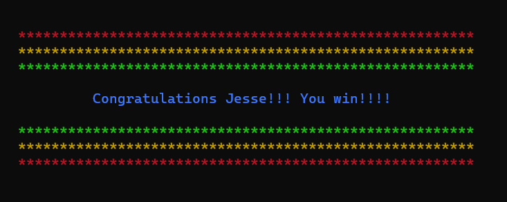

# Trivia Hunt

### <ins>Purpose:</ins>

This is a console game which is a combination of a trivia quiz and a treasure hunt. It will ask trivia questions and periodically drop treasure hunt clues based on the number of correct responses given. The user would asnwer questions, receive a hint, use it to search for hidden treasure in the surrounding area, come back to answer more questions to get more clues.

### <ins>Description:</ins>

This program will parse trivia questions from a CSV file with each line formatted like this: 
`Question, correct response, total responses, response 1, response 2, response 3....` 
For example: 
`Which blood type is the rarest in humans?,2,4,O negative,AB negative,B negative,A negative` 

It will also parse treasure hunt clues from a CSV file with each line containing a string representing a clue.

When a question is answered incorrectly it is re-shuffled into the queue. The game ends when all questions are answered correctly or all clues are given.

This program will save progress for an unfinished game. If the program is closed it will give an option to start from last progress.

### <ins>Technical details:</ins>

Language: C++ 
Tools: Visual Studio 2022

### <ins>Screenshots</ins>

    
    
    
    

### <ins>Learning outcomes:</ins>

- CSV File I/O, managing state, handling user input
- Best learning experience during this project was learning to make persistance state from scratch. It was a good thought exercise on saving and loading state at its most basic form.
- I made code readability a priority by abstracting code into named functions and replacing all magic numbers with enums and variables
- I focused on separation of concerns in each file, class and method
- I made several reusable utility functions for CSV parsing, changing console font colour and printing text at various speeds
